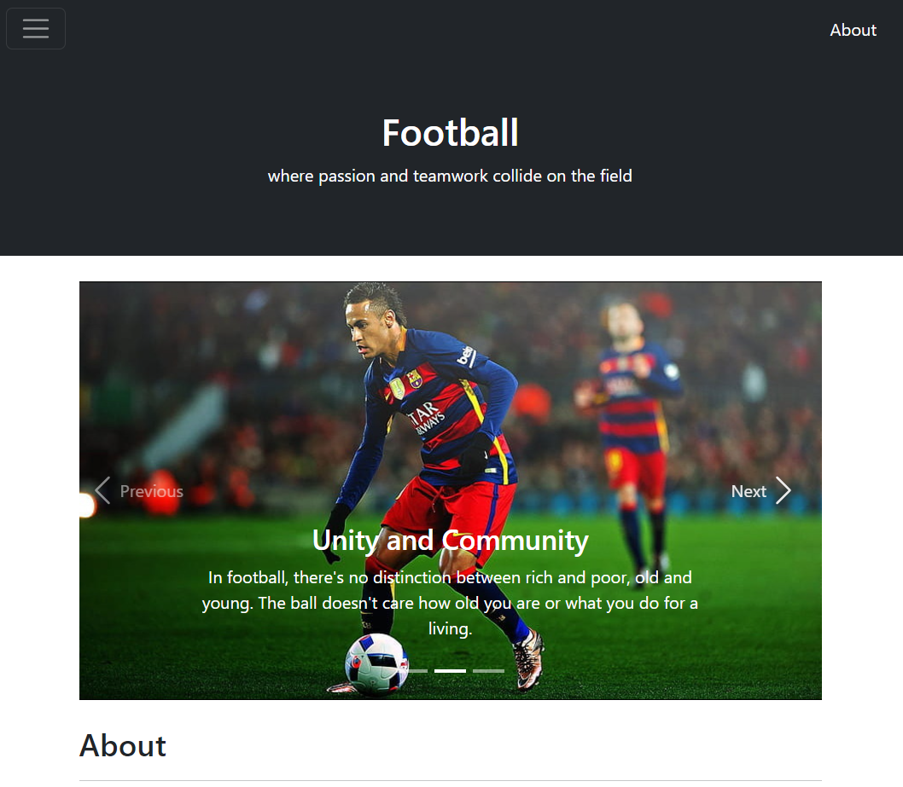
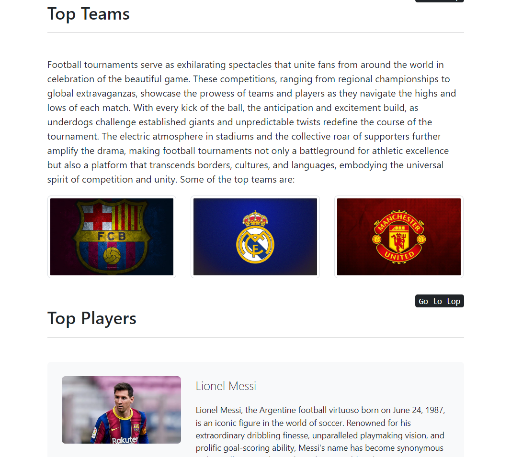

# ⚽ Football Webpage

Welcome to the **Football Webpage**, a beautifully designed site that showcases top football players, iconic football stadiums, and recent FIFA World Cup winners. This project is a great example of web development using **HTML** and **Bootstrap** for a responsive and visually appealing experience.

Check out the live website: [Football Webpage](https://sathiyanarayanansk.github.io/FootballWebpage-WebDevelopmentBootstrap/)

---

## 🌍 About the Website

This webpage is dedicated to all football enthusiasts. It features sections highlighting some of the greatest football players, renowned stadiums, and the most recent FIFA World Cup winners. The layout is built using **Bootstrap** for responsiveness, ensuring that it looks great on both desktop and mobile devices.

### Key Features:
- **Top Football Players**: Highlights of legendary football players such as **Lionel Messi**, **Cristiano Ronaldo**, and **Neymar**.
- **Stadiums**: Featuring iconic stadiums like **Camp Nou** and **Old Trafford**.
- **World Cup Winners**: A table listing the recent FIFA World Cup winners with scores.

---

## 🛠️ Tech Stack

This website is built using the following technologies:

- **HTML**: For the structure and content.
- **Bootstrap**: For responsive design and layout management.

---

## 🌟 Features

### ⚽ Top Players Section
Showcase of three football legends:
- **Lionel Messi** – Known for his extraordinary dribbling and goal-scoring abilities.
- **Cristiano Ronaldo** – A global icon with an incredible athletic profile and numerous trophies.
- **Neymar** – A Brazilian star known for his flair and creativity on the field.

### 🏟️ Stadiums Section
Learn about the history of two iconic stadiums:
- **Camp Nou** – Home to FC Barcelona with a seating capacity of over 99,000.
- **Old Trafford** – The Theatre of Dreams, home to Manchester United.

### 🏆 World Cup Winners
A table that showcases the winners of the recent FIFA World Cup tournaments, including the most recent 2022 World Cup in Qatar.

---

## 📸 Screenshots

Here are some visuals of the webpage:

---

## 🚀 How to Run the Webpage

To view the webpage locally or contribute to the project, follow these steps:

1. **Clone the repository** to your local machine.
2. **Navigate** to the project directory.
3. Open the `index.html` file in your browser to view the webpage.

---

## 🛠️ Development Setup

If you want to contribute to the project, here’s how you can set up the development environment:

1. Clone the repository to your local machine.
2. Navigate to the project directory.
3. Open the HTML files in your preferred text editor (e.g., Visual Studio Code).
4. Make changes to the HTML/CSS files and preview them in your browser.

---

## 🚧 Future Enhancements

- Add more football players and stadiums.
- Implement a dark mode toggle for better user experience.
- Add animations and interactivity using **JavaScript**.
- Include a **Leaderboard** for top football players and teams.

---

## 🤝 Acknowledgments

This project is powered by **Bootstrap**, which made creating a responsive design quick and efficient. Special thanks to the developers of Bootstrap for providing an excellent framework!

---

## 📬 Contact

Feel free to explore the project and share your feedback. For any inquiries, suggestions, or contributions, reach out to me at [sathiyanarayanan.s1698@gmail.com](mailto:sathiyanarayanan.s1698@gmail.com).

---

Happy browsing, and enjoy the football experience! ⚽
